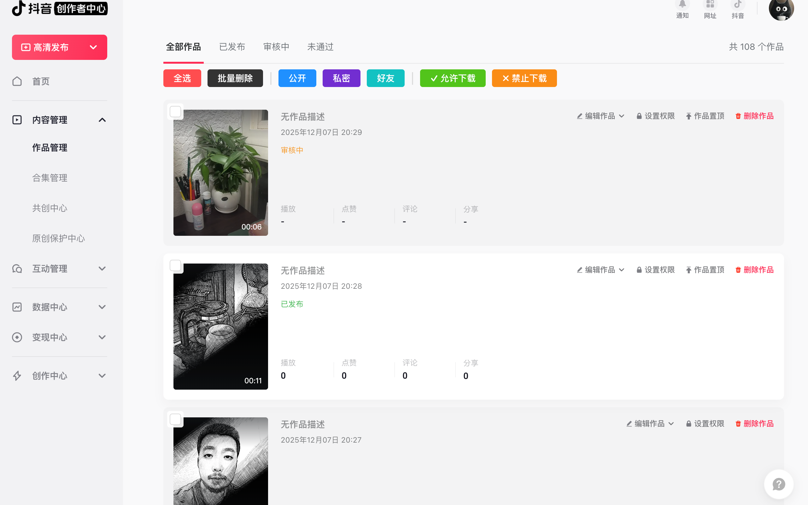
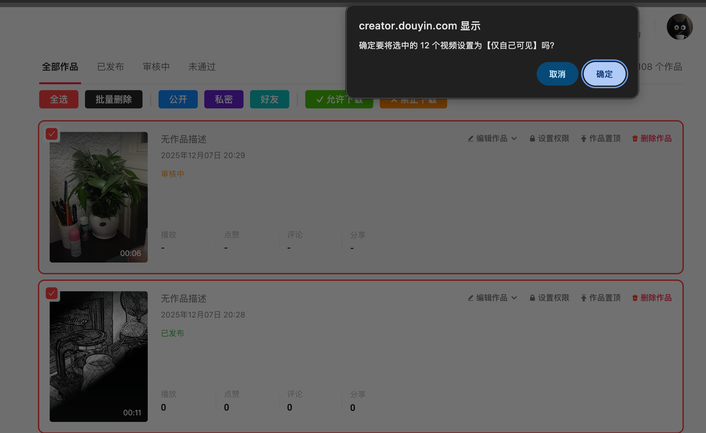

# 抖音批量管理工具 (Douyin Bulk Management)

<div align="center">

一个强大的 Chrome 扩展，用于批量管理抖音创作者平台的视频内容

[](https://chrome.google.com/webstore)
[](https://github.com/redrain-wang/douyin-bulk-management)
[](LICENSE)

[功能特性](#功能特性) • [安装使用](#安装使用) • [使用说明](#使用说明) • [技术实现](#技术实现) • [常见问题](#常见问题)

</div>

---

## 📋 功能特性

### 🎯 核心功能

- **✅ 批量选择** - 一键全选当前页面所有视频
- **🗑️ 批量删除** - 快速删除多个选中的视频（不可撤销）
- **👁️ 批量权限设置** 
  - 🌐 公开 - 所有人可见
  - 🔒 私密 - 仅自己可见
  - 👥 好友 - 仅好友可见
- **📥 批量下载权限**
  - ✅ 允许他人保存视频
  - ❌ 禁止他人保存视频
- **💾 批量下载视频** 
  - 📥 一键下载选中的视频到本地
  - 🎬 自动使用视频标题命名文件
  - ⚡ 智能下载队列，避免浏览器限制

### ⚡ 技术亮点

- **智能缓存** - 增量加载视频数据，内存占用优化 99%
- **自动适配** - 支持多标签页切换（全部作品/已发布/审核中/未通过）
- **防误操作** - 所有批量操作都有二次确认
- **无侵入性** - 不修改原页面结构，纯增强功能
- **实时同步** - 自动检测页面滚动，按需加载更多视频

---

## 🎬 功能展示

### 界面预览

<div align="center">

**主界面 - 批量操作按钮**



*批量选择和操作按钮清晰排列，支持全选、删除、权限设置*

---

**视频列表 - 复选框展示**



*每个视频卡片左上角显示复选框，支持单独勾选*

</div>

---

## 🚀 安装使用

### 方式一：开发者模式安装（推荐）

1. 克隆或下载本仓库
   ```bash
   git clone https://github.com/redrain-wang/douyin-bulk-management.git
   ```

2. 打开 Chrome 浏览器，访问 `chrome://extensions/`

3. 开启右上角的 **"开发者模式"**

4. 点击 **"加载已解压的扩展程序"**

5. 选择本项目中的 `chrome-extension` 文件夹

6. 安装完成！🎉

### 方式二：Chrome 应用商店（即将上线）

直接从 Chrome Web Store 安装（准备中）

---

## 📖 使用说明

### 基础操作

1. **访问抖音创作者平台**
   - 打开 [抖音创作者服务平台](https://creator.douyin.com/)
   - 登录你的账号
   - 进入 **内容管理 → 作品管理** 页面

2. **使用批量功能**
   
   页面顶部会自动显示操作按钮组：
   
   ```
   [全选] [批量删除] │ [公开] [私密] [好友] │ [✓允许下载] [✗禁止下载] │ [📥 批量下载]
   ```

3. **操作流程**
   - 勾选要处理的视频（点击视频卡片左上角的复选框）
   - 点击对应的功能按钮
   - 确认操作提示
   - 等待批量处理完成
   - 页面自动刷新显示结果（删除和权限设置）或查看浏览器下载管理器（批量下载）

### 功能详解

#### 📥 批量下载视频

1. **选择视频**：勾选需要下载的视频
2. **点击下载**：点击 "📥 批量下载" 按钮
3. **确认操作**：确认要下载的视频数量
4. **等待完成**：扩展会逐个下载视频，避免浏览器并发限制
5. **查看文件**：在浏览器的下载管理器中查看已下载的视频

**注意事项**：
- 视频文件名会使用视频标题自动命名（清理特殊字符）
- 下载过程中请保持页面打开，避免中断
- 下载速度取决于视频大小和网络状况
- 如果遇到下载失败，完成提示会显示成功和失败的数量

#### 🗑️ 批量删除

- **不可撤销**：删除操作无法恢复，请谨慎操作
- **操作间隔**：每次删除间隔 1000ms，避免请求过快

#### 👁️ 批量权限设置

- **可见性控制**：公开/私密/好友三种模式
- **下载权限控制**：允许/禁止他人保存视频
- **智能保护**：设置可见性时保持下载权限不变，反之亦然

### 高级技巧

- **快速全选**：直接点击"全选"按钮，无需逐个勾选
- **精确控制**：可以混合选择不同视频，统一设置权限
- **保护机制**：权限设置会保留其他配置不变（设置可见性时保持下载权限，反之亦然）
- **批量下载**：建议每次下载不超过 50 个视频，避免浏览器资源占用过高

---

## 🛠️ 技术实现

### 架构设计

```
┌─────────────────────────────────────┐
│   Content Script (content_unified.js) │
├─────────────────────────────────────┤
│  • UI 注入（按钮、复选框）            │
│  • 事件监听（点击、滚动、Tab切换）     │
│  • 缓存管理（增量加载，内存优化）     │
│  • API 调用（删除、更新权限）         │
└─────────────────────────────────────┘
           ↓
┌─────────────────────────────────────┐
│    Douyin Creator API                │
├─────────────────────────────────────┤
│  • /janus/douyin/creator/pc/work_list │
│  • /web/api/media/aweme/delete/       │
│  • /web/api/media/aweme/update/       │
└─────────────────────────────────────┘
```

### 核心特性

#### 1. 智能缓存策略
```javascript
// 只缓存必要字段（每个视频约 50 字节）
{
  aweme_id: "7580688999683031281",
  allow_download: true,
  private_status: 0
}
```

**内存优化对比：**
- 原始方案：100 个视频 ≈ 500KB
- 优化方案：100 个视频 ≈ 5KB（减少 99%）

#### 2. 增量加载
- 每次滚动只加载 12 个视频
- 使用 `max_cursor` 分页机制
- MutationObserver 监听 Tab 切换

#### 3. 权限保护
```javascript
// 更新可见性时，保持下载权限不变
formData.append('visibility_type', newValue);
formData.append('download', currentDownload);
```

### API 接口

| 接口 | 方法 | 功能 |
|------|------|------|
| `/janus/douyin/creator/pc/work_list` | GET | 获取视频列表 |
| `/web/api/media/aweme/delete/` | POST | 删除视频 |
| `/web/api/media/aweme/update/` | POST | 更新视频权限 |

---

## ⚙️ 配置说明

### 开发模式切换

在 `content_unified.js` 顶部：

```javascript
const DEBUG = false;  // 生产环境：false，开发环境：true
```

### 自定义参数

```javascript
// 每次加载视频数量
const countToFetch = 12;

// 删除请求间隔（毫秒）
await new Promise(r => setTimeout(r, 1000));

// 权限设置请求间隔（毫秒）
await new Promise(r => setTimeout(r, 500));
```

---

## ❗ 注意事项

### ⚠️ 重要提醒

- **删除操作不可撤销**，请务必仔细核对后再确认
- 建议定期备份重要视频内容
- 批量操作时请保持网络稳定
- 操作失败时会显示具体失败数量

### 🔐 隐私保护

- **本地运行**：所有逻辑在本地执行，不上传任何数据
- **无第三方服务**：不依赖外部服务器
- **Cookie 复用**：直接使用浏览器已登录的 Cookie
- **开源透明**：所有代码公开可审计

### 🐛 已知问题

- 页面快速滚动时可能需要等待数据加载完成
- 某些情况下需要手动刷新页面查看最新状态
- 抖音平台更新可能导致功能失效（会及时修复）

---

## 🔧 常见问题

### Q: 为什么有些视频无法选中？
A: 可能是页面还未加载完成，尝试向下滚动后再操作。

### Q: 批量操作失败怎么办？
A: 检查网络连接，确保已登录账号，查看控制台错误信息。

### Q: 会不会误删视频？
A: 每次删除都有确认提示，且只删除手动勾选的视频。

### Q: 支持其他浏览器吗？
A: 目前仅支持 Chrome 和 Edge（Chromium 内核）浏览器。

### Q: 如何更新扩展？
A: 开发者模式下点击"重新加载"按钮即可更新。

---

## 📊 版本历史

### v1.0.0 (2025-12-07)
- ✨ 首次发布
- ✅ 批量删除功能
- ✅ 批量权限设置（可见性 + 下载权限）
- ✅ 智能缓存优化
- ✅ 多标签页支持
- ✅ 增量加载机制

---

## 🤝 贡献指南

欢迎提交 Issue 和 Pull Request！

### 开发环境

1. Fork 本仓库
2. 创建特性分支 (`git checkout -b feature/AmazingFeature`)
3. 提交更改 (`git commit -m 'Add some AmazingFeature'`)
4. 推送到分支 (`git push origin feature/AmazingFeature`)
5. 开启 Pull Request

### 代码规范

- 使用 ES6+ 语法
- 添加必要的注释
- 保持代码整洁可读
- 测试后再提交

---

## 👨‍💻 作者信息

**redrain**
- Email: wangredrain@gmail.com
- GitHub: [@redrain-wang](https://github.com/redrain-wang)

---

## 📄 许可证

本项目基于 **MIT License** 开源

```
MIT License

Copyright (c) 2025 redrain

Permission is hereby granted, free of charge, to any person obtaining a copy
of this software and associated documentation files (the "Software"), to deal
in the Software without restriction...
```

---

## 🙏 致谢

感谢所有使用和反馈的用户！

如果觉得这个项目对你有帮助，欢迎 ⭐ Star 支持一下！

---

<div align="center">

**[⬆ 回到顶部](#抖音批量管理工具-douyin-bulk-management)**

Made with ❤️ by redrain

</div>
